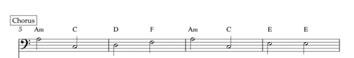
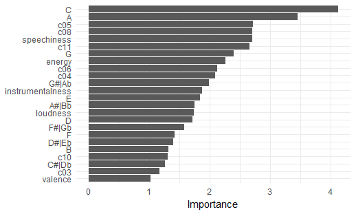

<style>

.storyboard-nav .sbframelist {
    margin: 0 auto;
    width: 94%;
    height: 70px;
    overflow: hidden;
    text-shadow: none;
    margin-bottom: 8px;
}

.storyboard-nav .sbnext, .storyboard-nav .sbprev {
    float: left;
    width: 2%;
    height: 70px;
    font-size: 50px;
}

</style>
```{r}
library(tidyverse)
library(spotifyr)
library(htmltools)
library(compmus)
library(plotly)
library(flexdashboard)
library(ggplot2)
library(plyr) 
library(egg)
library(ggdendro)
library(heatmaply)
library(tidymodels)
library(gghighlight)
library(cowplot)

# get the audio features
house <- get_playlist_audio_features("", "3Bjr19sZK5leO42HHU5Uwo") |>
  mutate(artist.name = map_chr(track.artists, \(x) x |> pluck("name", 1)))

bending <- get_playlist_audio_features("spotify", "4ak7z48oAQXMmytARE84Jp")
base <- get_playlist_audio_features("spotify", "6WtspFzvaGk58QtzHrtuRb")

Rising_Sun <- readRDS(file="data/Rising_Sun.Rda")
```

1. Corpus {.storyboard}
======================================
### Introduction

The house of the rising sun is an old folk song and like most folk songs the exact origins and author are unknown. The oldest published lyrics were written down by Robert Winslow Gordon, an academic collector of folk songs, in 1925. Throughout the last century many different covers of the song have been made with many different styles. Arguably the most well known version is of course the one by The Animals from 1964. Its Iconic arpeggio chords, the haunting vocals and the synth solo. Most people will point at this version of the song as the version of the house of the rising song that they know.\
However, many covers have been made of the song, 120 of which are in the corpus. Ranging from covers that stay very true to, what we will take as the ‘original’ song, the Animals version, all the way to covers that take most people a little time to recognize. But what makes a cover a very different style version of a song, but still recognisable? And is there a way to classify songs as a very similar style version as opposed to a very different one?\
This portfolio tries to answer which features are most important in classifying covers that are very similar to the original and covers that are very different from the original, when splitting the songs on genre. Looking at the differences between all the covers in the large collection, to see whether certain the Spotify generated features or lower level track analysis will show a good way to make a distinction.\
In the end the theory will be tested by training a random forest model on the features that were found to see whether they make a good classification tool to make a good distinction between the similar genres and the genres that differ a lot from the Animals version of the house of the rising sun.

***
```{r image, fig.show = "hold", out.width = "100%", fig.align = "default"}
knitr::include_graphics("figure/download.jpg")
```

<iframe style="border-radius:12px" src="https://open.spotify.com/embed/track/7BY005dacJkbO6EPiOh2wb?utm_source=generator" width="100%" height="140" frameBorder="0" allowfullscreen="" allow="autoplay; clipboard-write; encrypted-media; fullscreen; picture-in-picture" loading="lazy"></iframe>


### Explanation of the song
The concept of making covers of a song is interesting, as what makes it a cover and what makes it a different song? These covers all lean heavily one of two things, if not both: lyrics and motif.\ 

Some tracks are fully instrumental, but most of them will include a version of the lyrics. The Animals version shows a chorus, verse, bridge, verse, chorus structure, with a solo just before the bridge.\

Most tracks also rely on the motif and chord progression of the song: \
Am  - C   - D   - F   - Am  - C   - E7\
I   - III - IV  - VI  - I   - III - V7\

```{r i, fig.show = "hold", out.width = "50%", fig.align = "default"}

```

Some change the time signature, but the intervals generaly stay thesame throughout the entire corpus.

***
#### Lyrics
There is a house in New Orleans
They call the Risin' Sun
And it's been the ruin of many a poor boy
And God, I know I'm one\

My mother was a tailor
She sewed my new blue jeans
My father was a gamblin' man
Down in New Orleans\

Now, the only thing a gambler needs
Is a suitcase and a trunk
And the only time that he's satisfied
Is when he's all a-drunk Oh, Mother, tell your children
Not to do what I have done.
Spend your lives in sin and misery
In the house of the risin' sun\

Well, now one foot on the platform
The other foot on the train
I'm going back to New Orleans
To wear that ball and chain\

Well, there is a house in New Orleans
They call the Risin' Sun
And it's been the ruin of many a poor boy
And God, I know I'm one


### Genre distribution
This is the divide of the corpus into the two genre playlists:\

<iframe style="border-radius:12px" src="https://open.spotify.com/embed/playlist/6WtspFzvaGk58QtzHrtuRb?utm_source=generator" width="49%" height="352" frameBorder="0" allowfullscreen="" allow="autoplay; clipboard-write; encrypted-media; fullscreen; picture-in-picture" loading="lazy" align="left"></iframe>

<iframe style="border-radius:12px" src="https://open.spotify.com/embed/playlist/4ak7z48oAQXMmytARE84Jp?utm_source=generator" width="49%" height="352" frameBorder="0" allowfullscreen="" allow="autoplay; clipboard-write; encrypted-media; fullscreen; picture-in-picture" loading="lazy" align="right"></iframe>

The divide was made by hand and resulted in these genre distributions (chosic, 2023):\

```{r image_grobs, fig.show = "hold", out.width = "50%", fig.align = "default"}
knitr::include_graphics("figure/Base.png")
knitr::include_graphics("figure/Bending.png")
```

***

Generally, songs in the same genre have the same feel. As this corpus is made up of versions of the same song (in the sense of motif and lyrics), the main difference would be the style of playing this song. The songs that sound the most different are the ones played in a copmletely different style to the original. Thus the seperation of the corpus into two playlists was done based on genre (or my perception of it). \

The two playlists: one base genre playlist that adheres to the most appearing genres: rock, folk, country and blues and one genre bending playlist that includes many different genres, from scat jazz to Hip Hop.


2. Visualisations{.storyboard}
======================================
Inputs {.sidebar}
------------------------------------------------------------------
#### House of the Rising Sun
<iframe style="border-radius:12px" src="https://open.spotify.com/embed/playlist/3Bjr19sZK5leO42HHU5Uwo?utm_source=generator&theme=0" width="100%" height="450" frameBorder="0" allowfullscreen="" allow="autoplay; clipboard-write; encrypted-media; fullscreen; picture-in-picture" loading="lazy"></iframe>

### Stats on the corpus

```{r}
key <-
Rising_Sun%>%
  ggplot(aes(x=key, fill=as.factor(mode))) +
  ggtitle("Distribution of key signatures and mode")+
  xlab("key signature") +
  ylab("count") +
  geom_histogram(binwidth = 1)+
  labs(fill="Mode: 0 = minor")

key_playlist <- 
  Rising_Sun%>%
  ggplot(aes(x=key, fill=as.factor(playlist_name))) +
  ggtitle("Distribution of key signatures and mode")+
  xlab("key signature") +
  ylab("count") +
  geom_bar()+
  labs(fill="Playlist")

mode_playlist <- 
  Rising_Sun%>%
  ggplot(aes(x=as.factor(mode), fill=as.factor(playlist_name))) +
  ggtitle("Distribution of key signatures and mode")+
  xlab("key signature") +
  ylab("count") +
  geom_bar() +
  labs(fill="Playlist")

plot_grid(key, key_playlist, mode_playlist, ncol = 1)
```

---

The first plot shows that most of the versions uphold the Am key of the original, but there is still some distribution. You can see that as soon as people start playing around with the key they are more likely to change the mode as well.\
The second plot shows that the distribution of the key signatures is fairly equal. The third plot however shows the major mode is used much more frequently in the bending playlist.\
It is fairly easy to change the key of a piece as one can simply modulate all the notes of a piece. However changing the mode of a piece can influence the vibe of the piece, which might be tied into changing the genre.

### Tempo

```{r}
ggplot(Rising_Sun, aes(x=playlist_name, y=tempo)) +
  geom_boxplot()+
  xlab("Playlist") +
  ylab("Tempo") 

```

***

The average tempo of the Base playlist seems to be around 110 BPM and the that of the Bending playlist slightly higher at 120 BPM. The overall spread of the tempo's seems to be relatively equal. Both lists having only to outliers.

### Liveness, valence and instrumentalness
```{r}
analysis <- ggplot(Rising_Sun, aes(x=liveness, y=valence, color=instrumentalness, 
                                   shape=as.factor(playlist_name), label=artist.name)) +
  ggtitle("Liveness - Valence - Instrumentalness") +
  geom_point()+
  xlim(0,1) + 
  xlab("Liveness") +
  ylab("Valence") +
  labs(col="Instrumentalness", shape="Playlist") 
  
ggplotly(analysis,  tooltip = c("x", "y", "color", "shape", "label"))
```

***

The plot shows liveness to be relatively clustered, with just a handful of tracks going above 0.35. Valence on the other hand is relatively spread out, but does not make a clear distinction for either playlist. Instrumentalness seems to be favoring the lower end with the base genres, but is not very clear.

### Focus on Instrumentalness

```{r}
energy <- ggplot(Rising_Sun, aes(x=instrumentalness, fill=playlist_name)) +
  ggtitle("Instrumentalness distribution over all the songs")+
  xlab("Instrumentalness") +
  ylab("Count") +
  geom_histogram(binwidth = 0.1, position="dodge") 

ggplotly(energy)
```

---

This plot shows how the instrumentalness level throughout the entire corpus. The base genres dominate the lower end of the scale while the bending genres have a slight upperhand on the high end. 

### Energy, loudness and speechiness

```{r}
analysis <- ggplot(Rising_Sun, aes(x= energy, y=loudness, color=speechiness, 
                                   shape=as.factor(playlist_name), label=artist.name)) +
  ggtitle("Analysis: Energy - Loudness - Speechiness") +
  geom_point()+
  xlim(0,1) + 
  xlab("Energy") +
  ylab("Loudness") +
  labs(col="Speechiness", shape="Playlist") 
  
ggplotly(analysis,  tooltip = c("x", "y", "color", "shape", "label"))

```

---

The plot shows that the entire corpus does not contain any songs with high levels of speechiness. The highest would be the versions of Gregory Isaacs and Public enemy, reggae and HipHop respectively. But even they don't go above 0.3 in a 0-1 scale.\
The entire corpus has a wide distribution on energy but the loudest and ones with the most energy seem to all be from the bending playlist. Most of them related to metal, thus not surprising results.


### Focus on Energy

```{r}
energy <- ggplot(Rising_Sun, aes(x=energy, fill=playlist_name)) +
  ggtitle("Energy distribution over all the songs")+
  xlab("Energy") +
  ylab("Count") +
  geom_histogram(binwidth = 0.1, position="dodge") 

ggplotly(energy)
```

---

This plot shows how the energy throughout the entire corpus. It shows the base genres have a lower energy, while the bending genres are more evenly distrubuted in the energy.


3. Track level {.storyboard}
================================================
### Clustering

```{r}
data_for_clustering <- readRDS(file="data/data_for_clustering.Rda")

data_for_clustering |>
  ggdendrogram() +
  geom_text(data = label(data_for_clustering), aes(x, y, 
            label=label, hjust=0, colour=playlist_name),size=2) +
  coord_flip() +
  scale_y_reverse(expand=c(0.2, 0)) +
  theme(axis.line.y=element_blank(),
        axis.ticks.y=element_blank(),
        axis.text.y=element_blank(),
        axis.title.y=element_blank(),
        panel.background=element_rect(fill="white"),
        panel.grid=element_blank()) +
  labs(title = "Clustering the playlists: Base and Bending") +
  guides(
    colour = guide_legend(
      title = "Playlist"
    ) 
  )

```

***
To get a first understanding of what songs are similar the entire corpus was clustered. For the clustering a hierarchical clustering algorithm was used. The different splits are showcased in the dendrogram. The dendrogram shows a few clusters that are parted into the two genre playlists fairly well, but it is clear that this clustering doesn't provide a good distinction between the base and bending playlists.\
The Animals version is clustered into the middle into the very clean base genre cluster. The songs that it is percieved to be most similar to are: Eric Burdon and The Hippie Band. The songs that it is percieved to be very different from are: Sonja Malley, Somi and Wuauquikana.\
These are the songs we will take into the lower level track analysis.


### Sectioning
```{r, fig.width = 15, fig.height= 9}
Sonja_plot <- readRDS(file="data/Sonja.Rda")

Animals_plot <- readRDS(file="data/The_Animals.Rda")

Wuauquikuna_plot <- readRDS(file="data/Wuauquikuna.Rda")

Burdon_plot <- readRDS(file="data/Burdon.Rda")

Hippie_plot <- readRDS(file="data/Hippie.Rda")

Somi_plot <- readRDS(file="data/Somi.rda")

# Somi_plot <- Somi_plot |> ggtitle("Somi")
# saveRDS(Somi_plot, file="data/Somi.rda")


plot_grid(Animals_plot, Hippie_plot, Burdon_plot, Sonja_plot, Wuauquikuna_plot, Somi_plot, ncol = 3)
```

***

These selfsimilarity matrices show the structures that the piece has when it comes to chroma or timbre features. These songs are the most similar and different within the corpus.\
The Animals version shows a slight chorus-verse structures with a very different bridge in the middle of the song. The Hippie and Burdon versions show a very similar build up and also simulate the melody repeating that the chromagram shows with the very small block pattern.\
The Sonja and Wuauquikuna version also show this melody pattern in the chromagram which suggests they use the same melody (which is true listening to the songs), but show a different timbre seqtioning. Both these versions are instrumental and use piano and panflute respectively.


### Chordogram

```{r, fig.width = 15, fig.height= 9}
animals_plot <- readRDS(file="data/Animal_chord.rda")+
  ggtitle("The Animals")

Sonja_plot <- readRDS(file="data/Sonya_chord.rda")+
  ggtitle("Sonya O'Malley")

Wuauquikuna_plot <- readRDS(file="data/Wuauquikuna_chord.rda")+
  ggtitle("Wuauquikuna")

Hippie_plot <- readRDS(file="data/Hippie_chord.rda") +
  ggtitle("The Hippie Band")

Burdon_plot <- readRDS(file="data/Burdon_chord.rda")+
  ggtitle("Eric Burdon")

Somi_plot <- readRDS(file="data/Somi_chord.rda") + 
  ggtitle("Somi")


plot_grid(animals_plot, Hippie_plot, Burdon_plot, Sonja_plot, Wuauquikuna_plot, Somi_plot, ncol = 3)
```

***

All these covers are clearly in the key of A minor. The first five show almost no change throughout the song. The blue on the level of A major is fainter than that of A minor, which suggests the program recognizes the tonic and dominant of that key that appear in the piece.\
The last chordogram shows a very interesting picture. The piece by Somi is Scat jazz and during the piece the instruments, including the vocals, do not stay perfectly within the boundaries of the key. Added to that at around 160 seconds a trumpet starts playing a solo that glides through the keys. The very low level of yellow shows the program is not able to correctly identify the key as G major.


### Tempogram
All the tempograms are non-cyclic.
```{r, fig.width = 15, fig.height= 9}
animals_plot <- readRDS(file="data/animals_plot_temp.rda")+
  ggtitle("The Animals")

Sonja_plot <- readRDS(file="data/Sonja_plot_temp.rda")+
  ggtitle("Sonya O'Malley")

Wuauquikuna_plot <- readRDS(file="data/Wuauquikuna_plot_temp.rda")+
  ggtitle("Wuauquikuna")

Hippie_plot <- readRDS(file="data/Hippie_plot_temp.rda") +
  ggtitle("The Hippie Band")

Burdon_plot <- readRDS(file="data/Burdon_plot_temp.rda")+
  ggtitle("Eric Burdon")

plot_grid(animals_plot, Hippie_plot, Burdon_plot, Sonja_plot, Wuauquikuna_plot, ncol = 3)
```


***

The Animals tempogram shows a tempo of around 230 BPM, which keeps very steady until just before the end of the song where it slows down. This pattern is also present in the version of the Hippie Band, but the version of Eric Burdon starts at around 200 BPM and speeds ever so slightly throughout the song.\
The versions of Sonya and Wuauquikuna show a slight different pattern. Sonya's piano version was clearly hard to pinpoint due to the lack of a rythm section. Wuauquikuna's version starts out very unclear as this section only contains the panflute, but around 80 seconds a faint clapping appears which is replaced by a strumming guitar that show a clear tempo aroun 200 BPM. 


4. Forest and Conclusion {.storyboard}
=========================================
### Random Forest algorithm
Now we have found the features that show the difference between the genres and we will train an algorithm to see if these features can correctly make a distinction between the different genres of the covers.

#### Algorithm
A random forest algorithm is an algorithm that consists of many different decision trees. A decision tree splits on different features to give a prediction on the catagory the input belongs to. A random forest will run many decision trees and takes an average on their outcome to produce a prediction as well.\
This random forest was trained on the different keys, the different timbre features and the features energy, loudness, speechiness and instrumentalness as these features showed the most promise in making a distinction between the base genres and the bending genres.

#### Feature Importance
This figure shows the relative importance of al the features included:\

```{r im, fig.show = "hold", out.width = "70%", fig.align = "default"}

```


#### The results
The Forest never got very good as you can see in the numbers:

| Components | Precision |Recall  |
|------------|:---------:|:------:|
| Base       |     0.628 |   0.731|
| Bending    |     0.571 |   0.453|

The results for the bending genre playlist is as if it is merely guessing to which of the playlists the track belongs. For the base playlist the results are slightly better however the base playlist is also slightly larger than the bending one, which might have part in the difference.\
The corpus is a very small dataset, so it is not surprising the algorithm does not produce the greatest results.


### Conclusion
The covers in the Base playlist would sound fairly similar to the original whereas the bending playlist features versions that would take some people a bit of time to recognize as a cover of the house of the rising sun. This portfolio shows that even though the covers in the bending genre playlist sound much different to The Animals' version, it is hard to correctly predict them using MIR.\
After a look into which features showed any distinct difference between the two playlists and delving deeper into a lower level track analysis, the random forest that was trained on the features that were found to be most promising did not gather great results. Only slightly better than just guessing which playlist.\
This shows that having songs feel different to people is a much more difficult classifying task for a computer. Eventhough the random forest algorithm did not perform optimally, the analysis both on corpus and track level did indeed reveal differences between the playlists.\
The Bending genre playlist has a few tracks that are clear outliers in both energy and loudness, and the tempo's are slighlty higher in the bending playlist. The Animals version of the house of the rising sun shows a relatively straight forward buildup of chorus and verses and stays put in its tempo and key. The versions from the base playlist showed a similar pattern, while those from the bending playlist showed some differences in the different grams.

#### References
* Baker, D. J. (@davidjohnbaker1) & Burgoyne, J. A. (@jaburgoyne). (2023). compmus2023. GitHub repository. https://github.com/jaburgoyne/compmus2023

* Chosic. (2023, March 27). Spotify Playlist Analyzer - Chosic. https://www.chosic.com/spotify-playlist-analyzer/

* Müller, M. (2015). Fundamentals of music processing: Audio, analysis, algorithms, applications. Springer.
