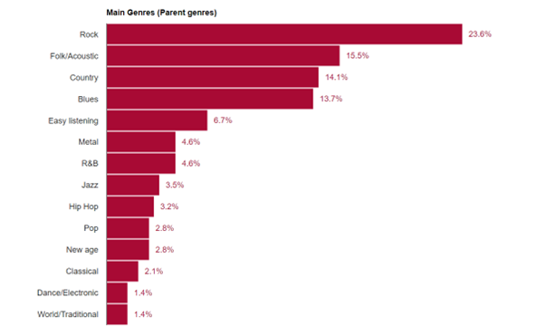

```{r}
library(tidyverse)
library(spotifyr)
library(htmltools)
library(compmus)
library(plotly)
library(flexdashboard)
library(ggplot2)
library(plyr) 
# get the audio features
house <- get_playlist_audio_features("", "3Bjr19sZK5leO42HHU5Uwo")
```

Key stuff
=============================================
```{r}
circshift <- function(v, n) {
  if (n == 0) v else c(tail(v, n), head(v, -n))
}

#      C     C#    D     Eb    E     F     F#    G     Ab    A     Bb    B
major_chord <-
  c(   1,    0,    0,    0,    1,    0,    0,    1,    0,    0,    0,    0)
minor_chord <-
  c(   1,    0,    0,    1,    0,    0,    0,    1,    0,    0,    0,    0)
seventh_chord <-
  c(   1,    0,    0,    0,    1,    0,    0,    1,    0,    0,    1,    0)

major_key <-
  c(6.35, 2.23, 3.48, 2.33, 4.38, 4.09, 2.52, 5.19, 2.39, 3.66, 2.29, 2.88)
minor_key <-
  c(6.33, 2.68, 3.52, 5.38, 2.60, 3.53, 2.54, 4.75, 3.98, 2.69, 3.34, 3.17)

chord_templates <-
  tribble(
    ~name, ~template,
    "Gb:7", circshift(seventh_chord, 6),
    "Gb:maj", circshift(major_chord, 6),
    "Bb:min", circshift(minor_chord, 10),
    "Db:maj", circshift(major_chord, 1),
    "F:min", circshift(minor_chord, 5),
    "Ab:7", circshift(seventh_chord, 8),
    "Ab:maj", circshift(major_chord, 8),
    "C:min", circshift(minor_chord, 0),
    "Eb:7", circshift(seventh_chord, 3),
    "Eb:maj", circshift(major_chord, 3),
    "G:min", circshift(minor_chord, 7),
    "Bb:7", circshift(seventh_chord, 10),
    "Bb:maj", circshift(major_chord, 10),
    "D:min", circshift(minor_chord, 2),
    "F:7", circshift(seventh_chord, 5),
    "F:maj", circshift(major_chord, 5),
    "A:min", circshift(minor_chord, 9),
    "C:7", circshift(seventh_chord, 0),
    "C:maj", circshift(major_chord, 0),
    "E:min", circshift(minor_chord, 4),
    "G:7", circshift(seventh_chord, 7),
    "G:maj", circshift(major_chord, 7),
    "B:min", circshift(minor_chord, 11),
    "D:7", circshift(seventh_chord, 2),
    "D:maj", circshift(major_chord, 2),
    "F#:min", circshift(minor_chord, 6),
    "A:7", circshift(seventh_chord, 9),
    "A:maj", circshift(major_chord, 9),
    "C#:min", circshift(minor_chord, 1),
    "E:7", circshift(seventh_chord, 4),
    "E:maj", circshift(major_chord, 4),
    "G#:min", circshift(minor_chord, 8),
    "B:7", circshift(seventh_chord, 11),
    "B:maj", circshift(major_chord, 11),
    "D#:min", circshift(minor_chord, 3)
  )

key_templates <-
  tribble(
    ~name, ~template,
    "Gb:maj", circshift(major_key, 6),
    "Bb:min", circshift(minor_key, 10),
    "Db:maj", circshift(major_key, 1),
    "F:min", circshift(minor_key, 5),
    "Ab:maj", circshift(major_key, 8),
    "C:min", circshift(minor_key, 0),
    "Eb:maj", circshift(major_key, 3),
    "G:min", circshift(minor_key, 7),
    "Bb:maj", circshift(major_key, 10),
    "D:min", circshift(minor_key, 2),
    "F:maj", circshift(major_key, 5),
    "A:min", circshift(minor_key, 9),
    "C:maj", circshift(major_key, 0),
    "E:min", circshift(minor_key, 4),
    "G:maj", circshift(major_key, 7),
    "B:min", circshift(minor_key, 11),
    "D:maj", circshift(major_key, 2),
    "F#:min", circshift(minor_key, 6),
    "A:maj", circshift(major_key, 9),
    "C#:min", circshift(minor_key, 1),
    "E:maj", circshift(major_key, 4),
    "G#:min", circshift(minor_key, 8),
    "B:maj", circshift(major_key, 11),
    "D#:min", circshift(minor_key, 3)
  )
```

This chord and key analysis is done for the version of the house of the rising sun by Somi. The songs genre as given by spotify is "contemporary vocal jazz". The reason for using this song is the complexity of the songs chord structures. At around 105 seconds a piano makes a very slow chord descent to play a few interesting chords.\
Compare this to the rock version by the Animals, which shows much more structured chords throughout the song:\

```{r}
Somi <-
  get_tidy_audio_analysis("3EkmeZvxvb2j8N84NgFTrQ") |>
  compmus_align(beats, segments) |>
  select(beats) |>
  unnest(beats) |>
  mutate(
    pitches =
      map(segments,
          compmus_summarise, pitches,
          method = "mean", norm = "manhattan"
      )
  )

Somi_plot <- 
  compmus_match_pitch_template(Somi,
    chord_templates,         # Change to chord_templates if descired
    method = "euclidean",  # Try different distance metrics
    norm = "manhattan"     # Try different norms
  ) |>
  ggplot(
    aes(x = start + duration / 2, width = duration, y = name, fill = d)
  ) +
  geom_tile() +
  ggtitle("Version by Somi") +
  scale_fill_viridis_c(guide = "none") +
  theme_minimal() +
  labs(x = "Time (s)", y = "")

Animals <-
  get_tidy_audio_analysis("7BY005dacJkbO6EPiOh2wb") |>
  compmus_align(beats, segments) |>
  select(beats) |>
  unnest(beats) |>
  mutate(
    pitches =
      map(segments,
          compmus_summarise, pitches,
          method = "mean", norm = "manhattan"
      )
  )

Animals_plot <- 
  compmus_match_pitch_template(Animals,
    chord_templates,         # Change to chord_templates if descired
    method = "euclidean",  # Try different distance metrics
    norm = "manhattan"     # Try different norms
  ) |>
  ggplot(
    aes(x = start + duration / 2, width = duration, y = name, fill = d)
  ) +
  geom_tile() +
  ggtitle("Version by the Animals") + 
  scale_fill_viridis_c(guide = "none") +
  theme_minimal() +
  labs(x = "Time (s)", y = "")

subplot(ggplotly(Somi_plot), ggplotly(Animals_plot))

```


Timbre and self-similarity matrix {.storyboard}
==============================================

### James Last - With Compliments

```{r}
James_Last <-
  get_tidy_audio_analysis("6kK3iMxfacrEa5B1s9mXmS") |> # Change URI.
  compmus_align(bars, segments) |>                     # Change `bars`
  select(bars) |>                                      #   in all three
  unnest(bars) |>                                      #   of these lines.
  mutate(
    pitches =
      map(segments,
          compmus_summarise, pitches,
          method = "rms", norm = "euclidean"              # Change summary & norm.
      )
  ) |>
  mutate(
    timbre =
      map(segments,
          compmus_summarise, timbre,
          method = "rms", norm = "euclidean"              # Change summary & norm.
      )
  )

James_Last |>
  compmus_gather_timbre() |>
  ggplot(
    aes(
      x = start + duration / 2,
      width = duration,
      y = basis,
      fill = value
    )
  ) +
  geom_tile() +
  labs(x = "Time (s)", y = NULL, fill = "Magnitude") +
  scale_fill_viridis_c() +                              
  theme_classic()

James_Last |>
  compmus_self_similarity(timbre, "cosine") |> 
  ggplot(
    aes(
      x = xstart + xduration / 2,
      width = xduration,
      y = ystart + yduration / 2,
      height = yduration,
      fill = d
    )
  ) +
  geom_tile() +
  coord_fixed() +
  scale_fill_viridis_c(guide = "none") +
  theme_classic() +
  labs(x = "", y = "")


```


---


This track (number 54) has the highest instrumentalness, 0.954. It uses a guitar to play the melody of the house of a rising sun. Around the 155 second mark this guitar melody gets replaced by a orchestra of violins. Around 200 seconds the violins make way for a sort of choir synth.\


### Oldest version - Clarence Ashley

```{r}
Clarence_Ashley <-
  get_tidy_audio_analysis("5CeknSovAcbZEoRBXbogun") |> # Change URI.
  compmus_align(bars, segments) |>                     # Change `bars`
  select(bars) |>                                      #   in all three
  unnest(bars) |>                                      #   of these lines.
  mutate(
    pitches =
      map(segments,
          compmus_summarise, pitches,
          method = "rms", norm = "euclidean"              # Change summary & norm.
      )
  ) |>
  mutate(
    timbre =
      map(segments,
          compmus_summarise, timbre,
          method = "rms", norm = "euclidean"              # Change summary & norm.
      )
  )

Clarence_Ashley |>
  compmus_gather_timbre() |>
  ggplot(
    aes(
      x = start + duration / 2,
      width = duration,
      y = basis,
      fill = value
    )
  ) +
  geom_tile() +
  labs(x = "Time (s)", y = NULL, fill = "Magnitude") +
  scale_fill_viridis_c() +                              
  theme_classic()

Clarence_Ashley |>
  compmus_self_similarity(timbre, "cosine") |> 
  ggplot(
    aes(
      x = xstart + xduration / 2,
      width = xduration,
      y = ystart + yduration / 2,
      height = yduration,
      fill = d
    )
  ) +
  geom_tile() +
  coord_fixed() +
  scale_fill_viridis_c(guide = "none") +
  theme_classic() +
  labs(x = "", y = "")
```


---


This shows the oldest version of the song in the corpus by Clarence Ashley in 1932. This version is just Clarence singing and playing the tune on guitar accompanied by a very quiet violin.\
When looking at the chromagram you can see that the timbre stays rather 


Corpus
======================================
Column {data-width=650}
--------------------------------------------------------------------
#### The House of the rising Sun
The house of the rising sun is an old folk song. And like most folksongs the exact origins and author are unknown. The oldest published lyrics were written down by Robert Winslow Gordon, an academic collector of folk songs, in 1925. Throughout the last century many different covers of the song have been made with many different styles. I would like to look at a large collection of different covers and see if all these drastically different versions have things in common or whether I can group them into different types of covers (other than just the genre on which the cover is based).


#### Explanation of the song
The concept of making versions of a song is interesting, as what makes it a cover and what makes it a different song? These covers all lean heavily on the lyrics (although some tracks are fully instrumental) and the motif and chord progression of the song: \
Am - C - D - F - Am - E - Am - E7\
I - III - Iv - VI - I - V - I - V7\
Most of the versions especially the earlier versions are in the key of A minor, so in the explanation this will be used as the key to explain the song other than the intervals.

#### Genre distribution
The playlist shows the most Rock, folk, country and blues. Like the version by the Animals. But there are a few interesting genres like Jazz and Hip Hop, such as the version by Public Enemy of Somi.

```{r picture, echo = F, fig.cap = "Genre distribution", out.width = '100%'}

```


Column {data-width=350}
---------------------------------------------------------------------

### Songs

<iframe style="border-radius:12px" src="https://open.spotify.com/embed/playlist/3Bjr19sZK5leO42HHU5Uwo?utm_source=generator&theme=0" width="100%" height="100%" frameBorder="0" allowfullscreen="" allow="autoplay; clipboard-write; encrypted-media; fullscreen; picture-in-picture" loading="lazy"></iframe>


Visualisations{.storyboard}
======================================
Inputs {.sidebar}
------------------------------------------------------------------
#### House of the Rising Sun
I want to add an explanation of the structure of the song and the chord progression, so show what even through all the changes, makes the covers from the same song.


### Energy, loudness and valence

```{r}
analysis <- ggplot(house, aes(x= energy, y=valence, color=as.factor(time_signature))) +
  ggtitle("Analysis: Energy - Loudness - Time signature") +
  geom_point()+
  xlim(0,1) + ylim(0,1) +
  xlab("Energy") + 
  ylab("Valence") +
  labs(col="Time signature")
ggplotly(analysis)

```


---


This plot shows the correlation between energy, loudness and valence. The main cloud of datapoints seem to have a similar distribution. Only for a small group of data points you can see that the tracks with the most energy and the highest valence are in 4/4 measure.

### Energy distribution overall

```{r}
energy <- ggplot(house, aes(x=energy)) +
  ggtitle("Energy distribution over all the songs")+
  xlab("Energy") + 
  ylab("Count") +
  geom_histogram(binwidth = 0.1, color="white", fill="aquamarine3") 

ggplotly(energy)
```


---


This plot shows how the energy throughout the entire corpus.

### Stats on the corpus

```{r}
house%>%
  mutate(mode=as.factor(mode)) %>%
ggplot(aes(x=key, fill=mode)) +
  ggtitle("Distribution of key signatures and mode")+
  xlab("key signature") + 
  ylab("count") +
  
  geom_histogram(binwidth = 1, color="white")

fig.height = 3
```


---


Most of the versions uphold the Am key of the originals, but there is still some distribution. You can see that as soon as people start playing around with the key they are more likely to change the mode as well.

Chromagram
======================================
The chromagram of the song: House of the rising song version by River Matthew.\
All the chromagrams show high levels of A and D. This is not all to surprising as  the song is in the key of D (key=2 given by Spotify), D being the root note and A being the perfect fifth. The mode of the song is minor, which is confirmed best by the Chebsyshev chromogram, which show F and very little of F# (which would be major). 

```{r}

R_Matthew <-
  get_tidy_audio_analysis("3dF0So7E8GhS6ViCMvhzCb") |>
  select(segments) |>
  unnest(segments) |>
  select(start, duration, pitches)
```
Row  {.tabset}
-----------------------------------------------------------------------

### Euclidean
```{r}
R_Matthew |>
  mutate(pitches = map(pitches, compmus_normalise, "euclidean")) |>
  compmus_gather_chroma() |> 
  ggplot(
    aes(
      x = start + duration / 2,
      width = duration,
      y = pitch_class,
      fill = value
    )
  ) + ggtitle("Euclidean") +
  geom_tile() +
  labs(x = "Time (s)", y = NULL, fill = "Magnitude") +
  theme_minimal() +
  scale_fill_viridis_c()
```

### Chebyshev
```{r}
R_Matthew |>
  mutate(pitches = map(pitches, compmus_normalise, "chebyshev")) |>
  compmus_gather_chroma() |> 
  ggplot(
    aes(
      x = start + duration / 2,
      width = duration,
      y = pitch_class,
      fill = value
    )
  ) + ggtitle("Chebyshev") +
  geom_tile() +
  labs(x = "Time (s)", y = NULL, fill = "Magnitude") +
  theme_minimal() +
  scale_fill_viridis_c()
```

### Manhattan
```{r}
R_Matthew |>
  mutate(pitches = map(pitches, compmus_normalise, "manhattan")) |>
  compmus_gather_chroma() |> 
  ggplot(
    aes(
      x = start + duration / 2,
      width = duration,
      y = pitch_class,
      fill = value
    )
  ) + ggtitle("Manhattan") +
  geom_tile() +
  labs(x = "Time (s)", y = NULL, fill = "Magnitude") +
  theme_minimal() +
  scale_fill_viridis_c()

```


Example of the code
==============================================
#### Importing libraries
```{r, echo=TRUE}
library(tidyverse)
library(spotifyr)
```

#### Getting the first playlist and track audio features

```{r, echo=TRUE}
house <- get_playlist_audio_features("", "3Bjr19sZK5leO42HHU5Uwo")

ggplot(house, aes(x=energy)) +
  ggtitle("Energy distribution over all the songs")+
  xlab("Energy") + 
  ylab("Count") +
  geom_histogram(binwidth = 0.1, color="white", fill="aquamarine3") 
```
